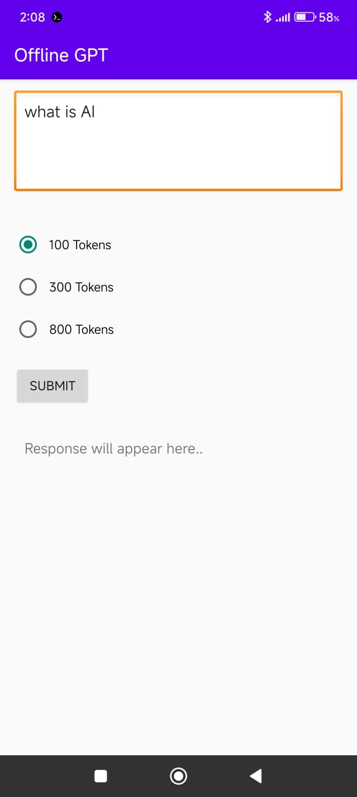
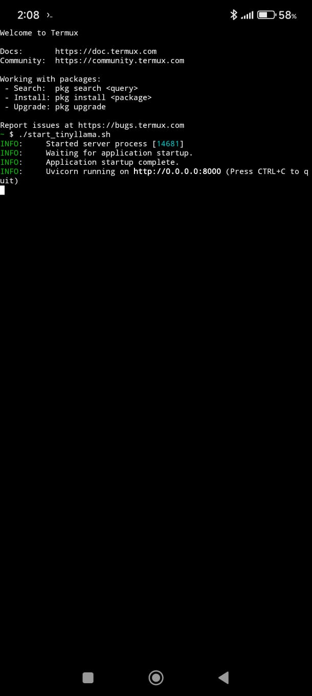

# 📱 TinyLLaMA Offline GPT – Android + Termux Project

> 🚀 **Revolutionizing Offline AI for Android** – This is one of the first-ever Android applications fully integrated with an **offline AI model** using **TinyLLaMA**, all powered through **Termux** without any internet dependency after setup!

---

## 🌟 Project Highlights

- ✅ Completely **offline** AI chatbot (no internet required after setup)
- ✅ Frontend in Android (Java)
- ✅ Backend using **Python + FastAPI** in **Ubuntu (Termux)**
- ✅ Model: **TinyLLaMA 1.1B Chat** (GGUF format)
- ✅ Integration with `llama.cpp` + `llama-cli`
- ✅ Dynamic token-based timer system
- ✅ One-click server start using `start_server.sh`


---

## 🏗️ Project Structure

```
TinyLLaMA_OfflineGPT/
├── Android_Frontend/               # Android Studio project
├── Termux_Backend/                # Python + FastAPI backend
│   ├── models/                    # GGUF model file (TinyLLaMA)
│   ├── llama.cpp/                 # Llama.cpp repo + llama-cli
│   ├── tinyllama_api.py          # FastAPI backend
│   ├── requirements.txt          # Required Python libraries
│   ├── run_instructions.txt      # All setup steps
│   └── start_server.sh           # One-command server starter
```

---
## 📸 Screenshots

Here are a few glimpses of the project in action:

### 🔹 Android App UI



### 🔹 Terminal Setup



---

## 🔧 Installation Steps

### 🔹 FRONTEND (Android App)

1. Open `Android_Frontend` in Android Studio.
2. Build the app.
3. App UI contains:
    - User Prompt Section
    - Token size selection: Basic (100), Medium (300), Large (800)
    - Submit button + Visual countdown timer
    - Response tab to view AI response

---

### 🔹 BACKEND (Termux + Python + FastAPI)

#### 🧪 1. Install Termux

```bash
pkg update && pkg upgrade
pkg install git python proot-distro
```

#### 🐧 2. Install Ubuntu in Termux

```bash
proot-distro install ubuntu
```

#### 🧑‍💻 3. Login to Ubuntu

```bash
proot-distro login ubuntu
```

#### 🐍 4. Inside Ubuntu: Install Python & setup virtual environment

```bash
apt update && apt install python3 python3-pip git
python3 -m venv venv
source venv/bin/activate
```

#### 📁 5. Clone llama.cpp and install requirements

```bash
git clone https://github.com/ggerganov/llama.cpp
cd llama.cpp
pip install -r ../requirements.txt
```

#### 🧠 6. Download TinyLLaMA Model

1. First, create a Hugging Face account and generate your Access Token here:
   https://huggingface.co/settings/tokens
2. Use your HuggingFace **Access Token** to download:

```bash
cd ../models

wget --header="Authorization: Bearer YOUR_HF_TOKEN" \
https://huggingface.co/TheBloke/TinyLlama-1.1B-Chat-v1.0-GGUF/resolve/main/tinyllama-1.1b-chat-v1.0.Q4_K_M.gguf

```

#### 🧠 7. Create FastAPI file (already added: `tinyllama_api.py`)

Runs llama-cli and returns model response via FastAPI.

#### 🔥 8. Start the server manually

```bash
uvicorn tinyllama_api:app --host 0.0.0.0 --port 8000
```

Or just use:

```bash
./start_server.sh
```

---

## 🧪 Testing the App

- Ensure backend is running.
- Install app on Android device.
- Enter prompt, choose token size, submit.
- Wait for visual timer to complete.
- Response appears in the response tab.

---

## 📌 Final Notes

- This project shows **how lightweight LLaMA models can empower Android devices** offline.
- Ideal for educational use, low-resource environments, or personal assistant tools without any server cost.
- Can be extended with on-device model loading in future using NDK/C++ or Llama.cpp ports.

---

## 🧠 Credits

- [TinyLLaMA](https://huggingface.co/cognitivecomputations/TinyLlama-1.1B-Chat-v1.0-GGUF)
- [Llama.cpp](https://github.com/ggerganov/llama.cpp)
- [Termux](https://termux.dev/)

---

## 🙌 Support & Contributions

Open to improvements, PRs, or even internship tasks!

---

Made with ❤️ by Gandham Venkatesh


